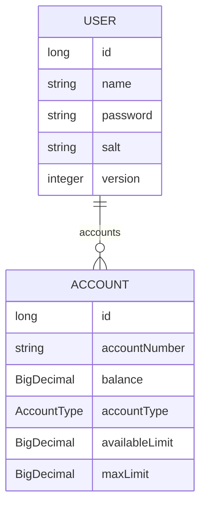

# demo Bank RESTful API

- Spring Boot;
- Spring Web;
- Spring Security;
  - JWT for security;
- Spring Data JPA;
- OpenAPI (Swagger) for endpoints documentation;
- H2 database in development;
- PostgresSQL in production;
- Lombok for clean code;
- Logback (Sl4j) for logging;
- Deployment with Railway;

## Usage
`/login` for authentication, retuns JWT toekn `Bearer`. 
`/register` user creation, retuns user with created accounts `SAVINGS` and `CHECKING` with balance 0.0 and `CHECKING` with `maxLimit` and `availableLimit` of `1000.00`. 
`/accounts` user must provider token for authentication obtained in the `/login` endpoint, and a account to `DEPOSIT` or `WITHDRAWAL`. 
- `WITHDRAWAL` is only available for the account owner.
- `DEPOSIT` can be made to any valid account.

## Diagram

