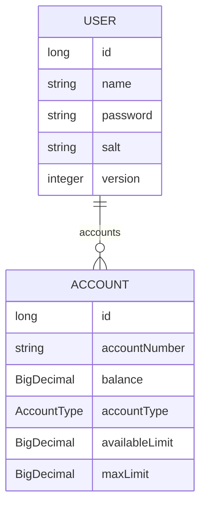

# demo Bank RESTful API

- Spring Boot;
- Spring Web;
- Spring Security;
  - JWT for security;
- Spring Data JPA;
- OpenAPI (Swagger) for endpoints documentation;
- H2 database in development;
- PostgresSQL in production;
- Lombok for clean code;
- Logback (Sl4j) for logging;
- Deployment with Railway;

## Diagram
